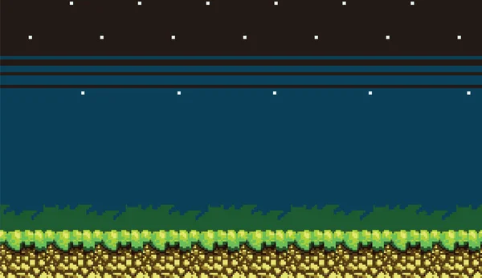
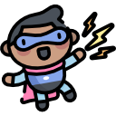
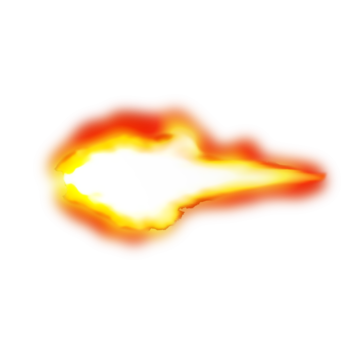
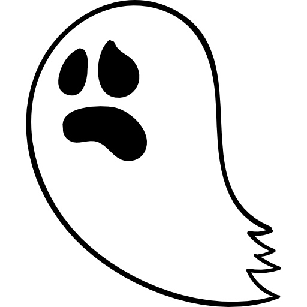

# Game Killing-Ghost 👻

Este é um jogo feito pelo Construct 3. 

É o meu primeiro jogo, e foi desenvolvido em uma atividade do meu curso de Desenvolvimento de Software Multiplataforma da Faculdade Fatec Franca.

O objetivo do jogo é atirar nos fantasmas, antes que eles se aproximem. A cada fantasma eliminado, é somado 10 pontos ao Score da partida. 

O jogo termina quando o personagem é atingido pelos fantasmas por 5 vezes.

OBS.: O jogo é web, para jogar, utilize um PC com teclado.

# Demonstração do jogo

# Link do jogo

https://jorgesantos96.itch.io/killing-ghost

# Banco de Dados

O jogo armazena as informações de "nome do jogador" e "pontuação" no Banco de Dados Firebase, conforme link abaixo:

https://killing-ghost-default-rtdb.firebaseio.com/game1.json

# Imagens do jogo

Imagem de fundo

Personagem principal

Bullet

Personagem Fantasma

Vida do personagem

